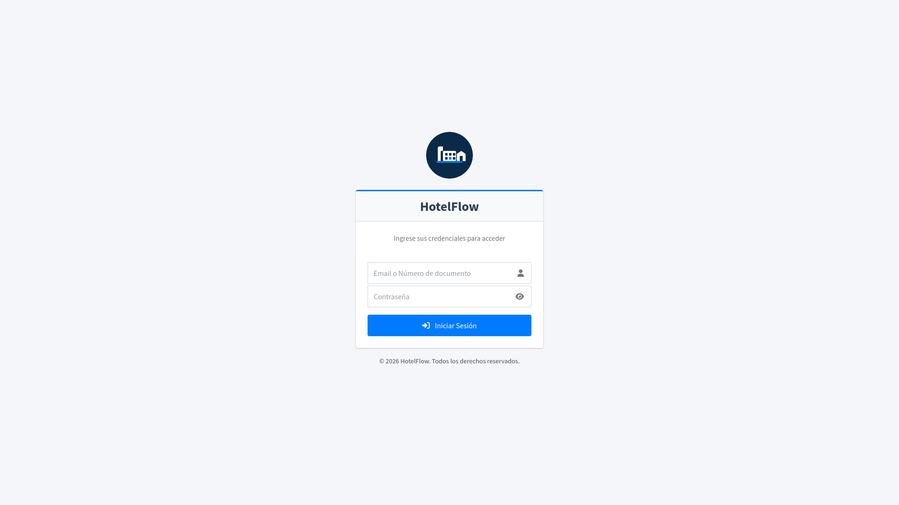
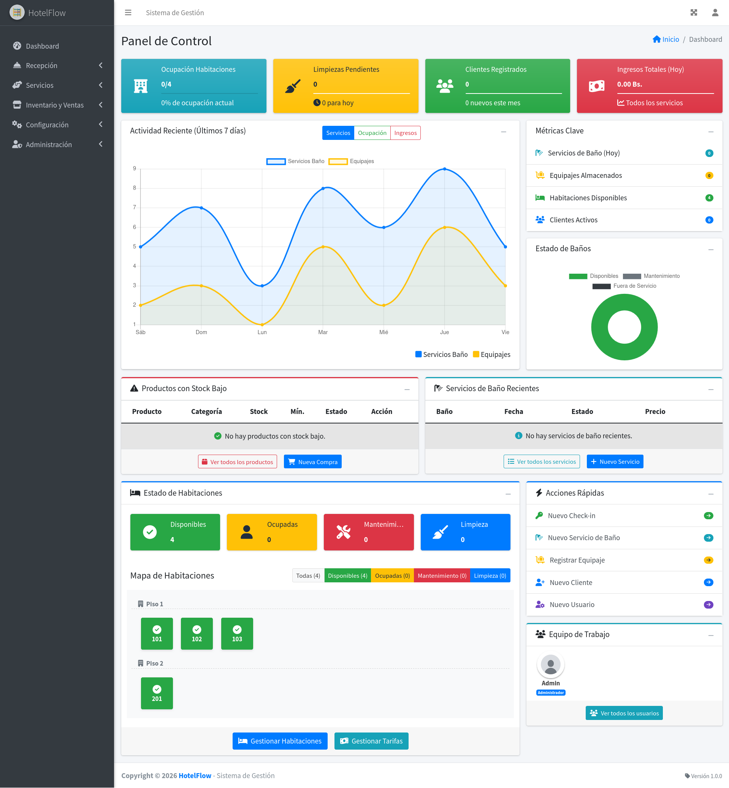
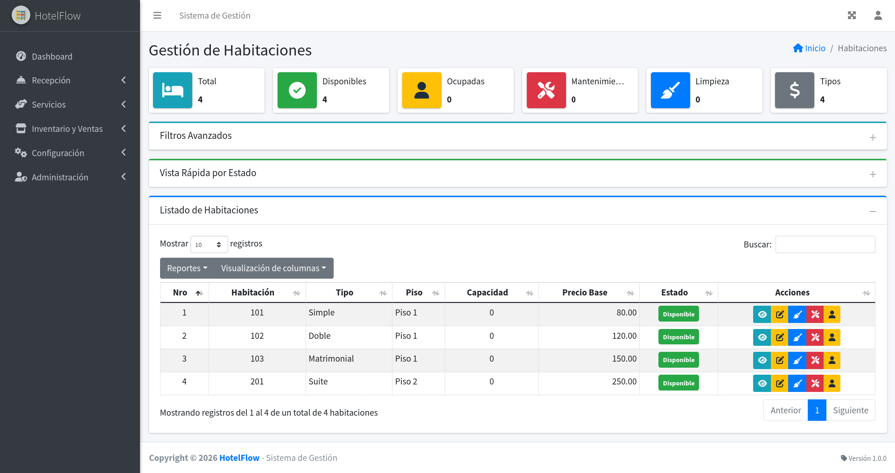
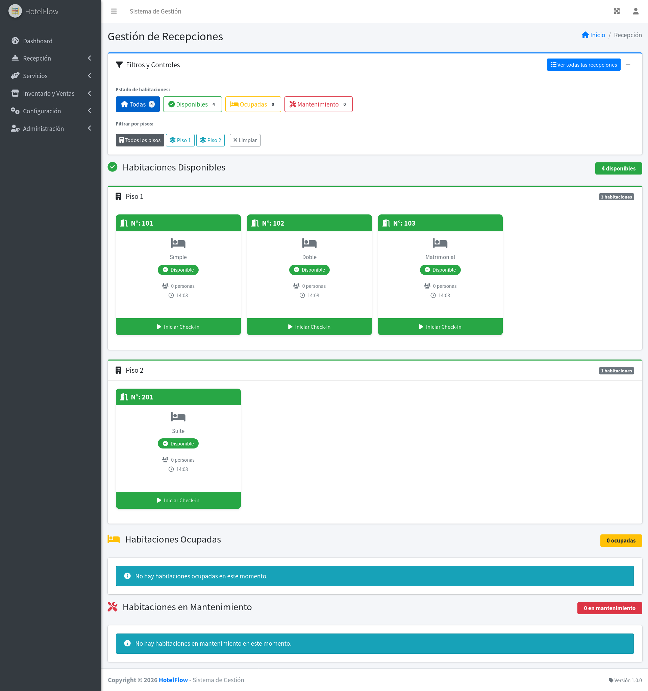
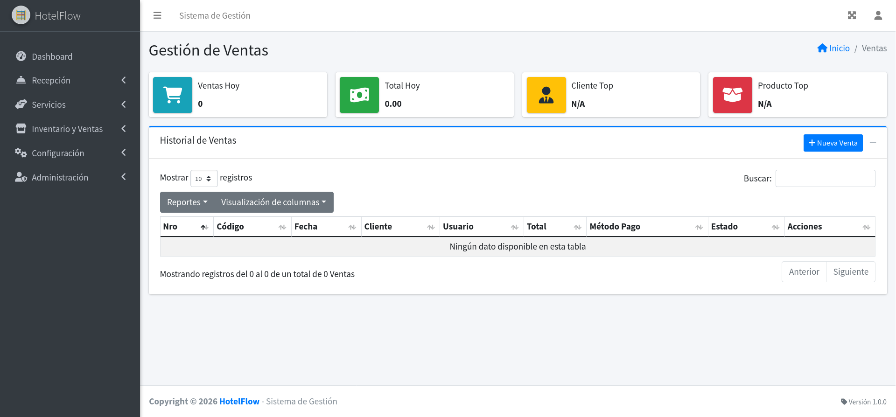
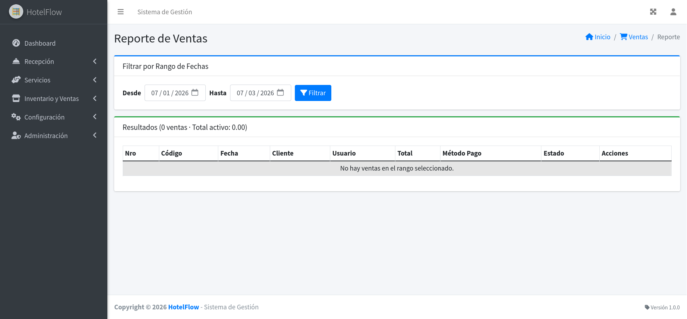

<div align="center">

# HotelFlow

**Sistema integral para la administración de establecimientos hoteleros**

[](CHANGELOG.md)
[](https://php.net)
[](https://mariadb.org)
[](https://getbootstrap.com)
[](LICENSE)

[Características](#características) •
[Instalación](#instalación) •
[Arquitectura](#arquitectura) •
[Módulos](#módulos) •
[Contribución](#contribución) •
[Changelog](CHANGELOG.md)

</div>

---

## Descripción

Aplicación web diseñada para la gestión completa de hoteles y establecimientos de alojamiento. Permite administrar habitaciones, huéspedes, servicios, inventario y transacciones comerciales mediante una interfaz moderna basada en AdminLTE.

## Capturas de pantalla

### Login

Acceso al sistema con autenticación de usuario y control de roles.



---

### Dashboard

Panel de métricas en tiempo real, adaptado según el rol del usuario.



---

### Habitaciones

Gestión de habitaciones por tipo, piso y estado de ocupación.



---

### Recepción

Proceso de check-in/check-out y registro de huéspedes.



---

### Ventas / Punto de venta

Registro de ventas con catálogo de productos y control de stock.



---

### Reportes

Exportación de reportes de ventas y estadísticas del negocio.



## Características

| Módulo           | Funcionalidades                                                                                                                                                            |
| ---------------- | -------------------------------------------------------------------------------------------------------------------------------------------------------------------------- |
| **Habitaciones** | Gestión por tipo, piso y estado. Sistema de tarifas y galería de imágenes                                                                                                  |
| **Recepción**    | Panel único con tabs Hoy / Mapa de habitaciones / Historial, KPIs del día, folio de huésped con cargos/pagos múltiples, check-in/out, cambio de habitación auditable, validación de solape, recibos y tarjeta de registro |
| **Servicios**    | Baños, limpieza y almacenamiento de equipaje con seguimiento en tiempo real                                                                                                |
| **Comercial**    | Punto de venta, control de inventario, compras y reportes                                                                                                                  |
| **Dashboard**    | Métricas en tiempo real, estadísticas por rol y exportación de reportes                                                                                                    |
| **Usuarios**     | Sistema de roles (Admin, Recepcionista, Limpieza) con permisos granulares                                                                                                  |

## Requisitos

| Componente   | Versión                           |
| ------------ | --------------------------------- |
| PHP          | 8.2.4+ con PDO, GD, mbstring, zip |
| MariaDB      | 10.4.28+                          |
| Servidor Web | Apache o Nginx                    |

## Instalación

### 1. Clonar el repositorio

```bash
git clone https://github.com/WorkTeam01/HotelFlow.git
cd HotelFlow
```

### 2. Importar la base de datos

```bash
mysql -u root -p < database/db_hotel_flow.sql
```

Opcionalmente, carga datos de ejemplo:

```bash
mysql -u root -p db_hotel_flow < database/seed.sql
```

### 3. Configurar variables de entorno

Copiar el archivo de ejemplo y configurar las credenciales:

```bash
cp .env.example .env
```

Edita el archivo `.env` recién creado con tu configuración de base de datos y la URL de la aplicación.

### 4. Establecer permisos

```bash
# Unix/Linux/Mac
chmod -R 755 public/uploads/
chmod -R 755 libs/TCPDF-main/

# Windows (como administrador)
icacls "public\uploads" /grant Everyone:F /T
```

### 5. Acceder al sistema

```
http://localhost/HotelFlow/
```

**Credenciales por defecto:** `admin@hotelflow.local` / `admin123` (el campo de login pide correo o número de documento, no un nombre de usuario)

> **Importante:** Cambiar las credenciales inmediatamente después del primer acceso.

## Arquitectura

El sistema implementa el patrón **MVC (Modelo-Vista-Controlador)**:

```
HotelFlow/
├── config/              # Configuración y conexión BD (Singleton)
├── controllers/         # Lógica de control por módulo
├── models/              # Capa de acceso a datos (PDO)
├── views/               # Templates PHP y layouts
├── services/            # Servicios (Auth, Imágenes, Utilidades)
├── public/              # Assets (CSS, JS, uploads)
├── libs/                # Librerías (TCPDF)
└── index.php            # Punto de entrada
```

### Stack Tecnológico

**Backend**

- PHP 8.2+ con arquitectura MVC
- PDO para acceso a datos
- TCPDF 6.7.5 para generación de PDF
- Sistema de sesiones con RBAC

**Frontend**

- Bootstrap 4 + AdminLTE 3 (tema claro único, sin dark mode)
- jQuery 3 + DataTables
- SweetAlert2 + Select2
- Font Awesome 6
- CSS/JS por módulo vía `$module_styles` / `$module_scripts` (sin assets inline)

## Módulos

### Gestión de Habitaciones

- Tipos: Simple, doble, matrimonial, suite
- Estados: Disponible, ocupada, mantenimiento, limpieza
- Organización jerárquica por pisos
- Sistema de tarifas configurable

### Recepción

- Panel único con tabs: **Hoy** (llegadas, salidas previstas y huéspedes en casa con acción inline), **Mapa** (room rack denso con doble dimensión ocupación + housekeeping) e **Historial**
- Barra de KPIs del día: ocupación %, ADR, ingresos, pendientes y habitaciones sucias
- Nueva reserva en página única con resumen en vivo; check-in/check-out con cobro de saldo por el folio
- Folio de huésped con múltiples cargos y pagos (libro mayor auditable)
- Cambio de habitación con historial y cargo automático de diferencia de tarifa
- Validación de solape de fechas por habitación (anti-overbooking) en UI y servidor
- Liberación automática de reservas no confirmadas (no-show)
- Buscador global de reserva/huésped, recibos PDF y tarjeta de registro imprimible

### Servicios

- **Baño y Limpieza:** Asignación de tareas, precios dinámicos
- **Equipaje:** Control de entrada/salida, recibos de depósito

### Sistema Comercial

- Punto de venta con catálogo de productos
- Control de stock automático
- Gestión de compras y proveedores
- Reportes exportables (PDF, Excel)

### Roles y Permisos

| Rol               | Acceso                                                   |
| ----------------- | -------------------------------------------------------- |
| **Administrador** | Acceso completo, gestión de usuarios y configuración     |
| **Recepcionista** | Habitaciones, huéspedes, check-in/out, ventas            |
| **Limpieza**      | Dashboard especializado, asignaciones, cambio de estados |

## Base de Datos

22 tablas con motor InnoDB y codificación UTF-8 (utf8mb4).

**Tablas principales:** `usuarios`, `habitaciones`, `tipo_habitacion`, `pisos`, `persona`, `recepcion`, `productos`, `categoria`, `venta`, `compra`, `servicio_bano`, `almacenamiento_equipaje`, `asignaciones_limpieza`, `tarifas`, `permiso`, `intentos_login`

## Contribución

Las contribuciones son bienvenidas. Para colaborar:

1. Haz un fork del repositorio
2. Crea una rama descriptiva: `git checkout -b feature/nueva-funcionalidad`
3. Realiza tus cambios siguiendo las convenciones del proyecto (ver [CLAUDE.md](CLAUDE.md))
4. Commit: `git commit -m 'Añadir nueva funcionalidad'`
5. Push: `git push origin feature/nueva-funcionalidad`
6. Abre un Pull Request describiendo el cambio y su motivación

Antes de reportar un bug o proponer una funcionalidad, revisa los [issues](https://github.com/WorkTeam01/HotelFlow/issues) existentes.

## Licencia

Este proyecto está distribuido bajo la licencia [MIT](LICENSE). Puedes usarlo, modificarlo y distribuirlo libremente, incluso con fines comerciales, siempre que mantengas el aviso de copyright.

## Historial de cambios

Consulta [CHANGELOG.md](CHANGELOG.md) para el registro detallado de versiones.

---

<div align="center">

**Proyecto Open Source** · Publicado en 2026

Si este proyecto te resulta útil, considera darle una ⭐ en GitHub.

</div>
